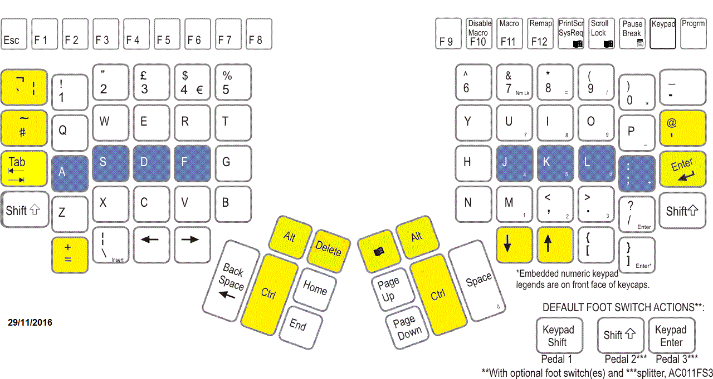

I've been interested in ergonomic input peripherals for some time, but a recent relapse of RSI persuaded me to dive straight in to the deep-end. I ended up choosing the
[Kinesis Advantage2][#advantage2] and the [Kensington Slimblade Trackball][#slimblade].  The purpose of this blog post is to share my experiences with this particular setup.

\

\

## Kinesis Advantage2

The Advantage2 is a mechanically-switched keyboard with a matrix layout of keys arranged into concave wells and two additional thumb-key clusters. Mechanical keyboards are typically less tiring on the fingers, as the key switches do not need to bottom-out in order to activate. Unfortunately they have mostly disappeared from the mainstream over the years, likely due to the drive for ever cheaper components.  A standard issue membrane keyboard typically costs less than ten pounds, frequent typists deserve better.
The matrix layout on the Advantage2 replaces the staggered arrangement needed by nineteenth-century typewriters. I found it easier to reach the keys above and below the home row and can actually touch-type symbols now, which is very useful for programming. The thumb clusters are an obvious idea, it makes sense to use the strongest digit for more than the space bar.
Finally, the concave wells permit even less movement of the hands and fingers, but do complicate manufacture. I'm not surprised that this feature is hard to find.
The Advantage2 is certainly the most comfortable keyboard I have ever used. It's also highly programmable. It is possible to remap keys and record/play keystroke macros. Configuration can also be edited using text-files mounted as a USB-drive - an excellent idea.

### My layout

Layouts are of course highly dependent on personal preference. I'm too lazy to learn statistically superior key layouts and my touch typing is far from the limits of QWERTY, for this reason I mostly stick with UK QWERTY. However, as a heavy Emacs user, I am interested in better placement of the modifier keys: Ctrl and Alt. I often use these modifier keys in order stay close to the home row, preferring for example Ctrl+a and Ctrl+e to jump to the home and end respectively, instead of the dedicated keys.
My criteria for placement of the modifier keys was as follows:

* Ctrl and Alt operated by thumbs;
* Ctrl and Alt easily pressed together;
* Symmetrical modifiers, in order to reduce "chording" keys on one hand.

Enter and Tab I chose to keep largely in their usual places. I use these keys less than Ctrl and Alt; and don't mind using my pinky to get to them. CapsLock and Insert are unfortunately my casualties. I cannot type these at all now, but at least I can now touch type many more of the keys that I still have.

When exported as a text file from the Advantage2, my mappings look like this:

~~~
[=]>[`]
[caps]>[\]
[up]>[down]
[down]>[up]
[`]>[=]
[lalt]>[delete]
[ralt]>[lwin]
[\]>[enter]
[lctrl]>[lalt]
[delete]>[lctrl]
[rctrl]>[lalt]
[enter]>[rctrl]
~~~

\

## Kensington Slimblade Trackball

I've been tempted to try a Trackball for a while, as I have large multi-monitor setups at both home and work, making a mouse quite uncomfortable to use.  I specifically wanted a large heavy ball that I could operate with my whole hand, rather than a smaller thumb-operated one. The Kensington Slimblade offers this, together with a low profile that helps keep my wrist in a straight position.
Using a trackball really has been a revelation, I find it much less effort. If I want to move the pointer a large distance, I spin the ball and it moves using the momentum of the ball. With practice it's possible to get the spin just right. For fine delicate movements, the trackball feels just as precise as a mouse, though again it may take some practice.

### Scrolling

Scrolling is one area where trackballs often rate poorly. The Slimblade has a unique solution that works surprisingly well, it has extra sensors to track the rotation of the ball. I can rotate the ball using just my ring finger pressing against the ball and the rim around it - it's much more comfortable than scrunching up my finger using a mouse wheel. For two-dimensional scrolling, or scrolling rapidly, I have configured one of the four buttons as a sticky scroll-state switch. It's great when reading long documents to be able to spin the ball for easy and rapid scrolling.  Surprisingly, Kensington's own TrackballWorks software does not support this, but it is easily accomplished using the free [XMouse button control program][#xmouse].

* * * * * * * *

[#advantage2]: https://www.kinesis-ergo.com/shop/advantage2/
[#slimblade]: https://www.kensington.com/en/gb/4493/k72327eu/slimblade-trackball
[#xmouse]: https://www.highrez.co.uk/downloads/xmousebuttoncontrol.htm
